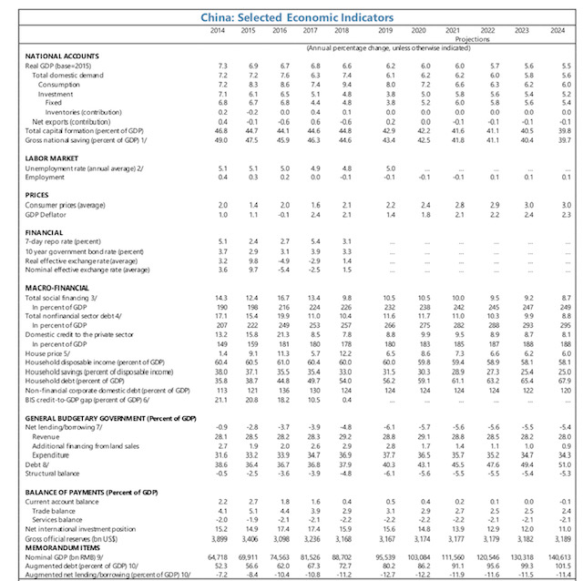
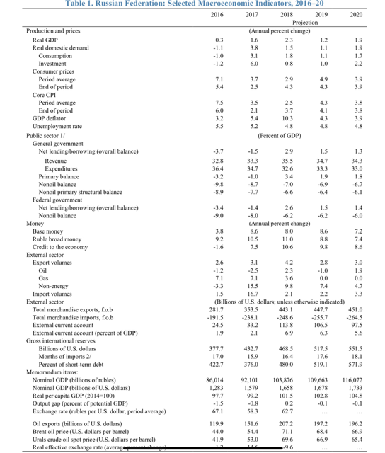

```{r setup, include=FALSE}
knitr::opts_chunk$set(echo = FALSE)
```

##  General framework
* Real economy (output, price level, exchange rates)
* Government sector (fiscal revenues and expenditures)
* Monetary and financial sector 
* External sector (BoP and IIP)

__Modeling requires these four sectors to be consistent with one another__

## External sector
* Free trade a rare area of consensus among economists
* International trade allows global production to be organized more efficiently: international division of labor
* Breaks the identity that domestic consumption and investment = domestic production
* Spending in excess of domestic production can be financed by accumulating external liabilities
* Excess of production over spending results in accumulation of external wealth

## External sector and international political economy
* External imbalance tell you a lot about a country
  + Its stage of development
  + The adquacy of its policies (macroeconomic as well as structural)
  + A major source of economic and financial crises, perhaps with politic origins ans always with political consequences
* Cross-national external imbalances a source of international conflict
  + Debates about excessive surpluses or deficits
  + Long standing debate on "who adjusts?"
* Involves the contribution of international institutions (e.g., IMF)

## Balance of payments - some basics
* Records transactions of goods, services, and assets between residents and foreign residents in two separate accounts:
    + Current account
    + Capital and financial account
* Transactions recorded in a major international currency, normally USD
* Complied on accrual accounting basis
* Constructed with double entry accounting system: + is a credit and - a debit.

## BOP - Current account
* Goods - Trade balance = exports - imports of goods
* Services
    + Transporation/travel
    + Government services
    +Other services
* Income
    + Compensation of employees
    + Investment income
* Current transfers

__The CA balance is often short hand for a country's external position__

## BOP Capital account
  * Capital account: 
    + Capital transfers 
    + Acquisition/disposal of non-produced, nonfinancial assets

* Financial account 
    + Direct investment (FDI), net
    + Portfolio investment, net
    + Other investments, net
    + Loans, trade credits
    + Reserve assets - finance imbalances elsewhere in BOP (important to understand)
    
## Determinants of CAB: savings and investment - absorption approach
* CAB = Gross national disposable income (GNDI) - Absorption (A)
* CA deficit occurs when  a country spends beyond its means or absorbs more than it produces
* Thus, reducing CA deficit requires an increase in income and/or reduction in absorption
* Increasing output (and hence income): 
    + Short-term: requires unused capacity
    + Medium-term: increased production capacity through investment, labor force participation, and structural policies
* Reducing absorption achieved by contracting final consumption or investment

## Determinants of CAB: savings and investment - SI approach
* Savings-investment balance approach
    + CAB = Savings - Investment
* In this view, CAB reflects country's use of foreign savings
* Excess of investment over savings must be covered by foreign saving
* CA deficit thus reduced by increasing savings and/or reducing investment

## Determiants of CAB: capital flows and reserves
* The CAB identities imply:
    + CAB + Net Capital Inflow (FI) - Change in Reserves (delta RES) = 0
* CA deficit can be maintained only as long as capital inflows persist and/or net official international reserves decline
* Large and persistent CA deficits and increasing net international indebtedness raise questions over sustainability

## Are current account deficits or surpluses bad? (1)
* In principle, deficits and surpluses are normal and may be related to stages of development

* Lower income countries might run CA deficits as part of economic development: there are profitable domestic investment opportunities but insufficient finance (capital should flow "downhill")

* CA deficits may be optimal response to temporary negative shock

* Aging economies may run CA surpluses as foreign assets are accumulated to fund retirement consumption

* CA surpluses may reflect attempt to "insure" against financial crises or cyclical downturns in commodities prices

## Are current account deficits or surpluses bad? (2)

* On the other hand, CA surpluses or deficits may reflect broader
problems in macroeconomic or structural policies

* For example, excessive domestic demand pressures may result from
loose fiscal policy, translating into higher imports with no
corresponding increase in exports

* Or expectations for excessively tight monetary policy or weak labor
markets may encourage high household savings rates and surpress
demand for imported goods

## Indicators of external vulnerability

* In countries without or limited capital markets access, CA deficits are
financed through changes in gross foreign reserves. A risk indicator
for these countries is the
stock of international reserves to monthly
import bill.
The standard is normally that three months is sufficient

* For those with capital markets access, CA deficits can be financed
through foreign borrowing, portfolio inflows, or FDI. The composition
of financing matters, some specific metrics include:

+ Ratio of short term debt to reserves
+ Exchange rate behavior
+ Interest rate spreads against a benchmark, such as U.S. government bonds
+ Is country vulnerable to financing disruptions

## Current account and the real exchange rate
* CA position closely linked to the level of the real exchange rate ( =
price of domestic consumption basket vs. foreign consumption
basket)

*  A real exchange rate appreciation occurs when domestically produced
goods become more expensive than goods produced abroad

* As labor is the largest component in most sectors, labor costs are a
big determinant of domestic inflation and unit labor costs are another
basis to measure the real exchange rate

* Normally a real exchange rate appreciation will lead to a deterioration
in the CA

# 
```{r message = F, warning = F}
library(ggplot2)
library(reshape2)

bop <- read.csv("bop.csv", sep = ",", header = T)

bop <- melt(bop, id = c("year"))

ggplot(bop) + geom_line(aes(x = year, y = value, color = variable)) +
  labs(title = "Current Account Balance (% GDP)", caption = "Source: International Monetary Fund.") +
  xlab("") + ylab("") +
  theme(plot.title = element_text(hjust = 0.5), plot.caption = element_text(hjust = 0.0),
        legend.title = element_blank())

```


# 


#



